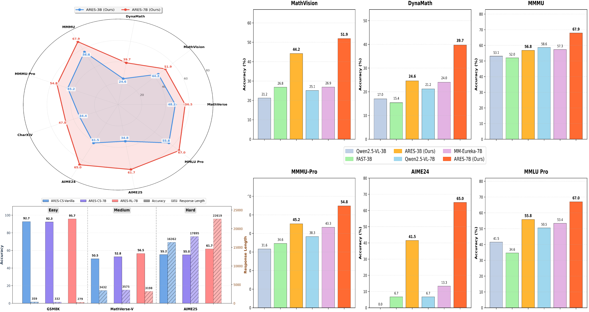
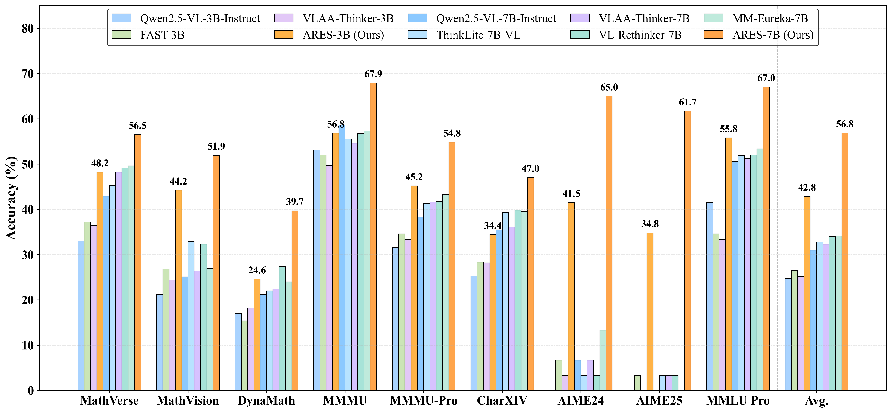
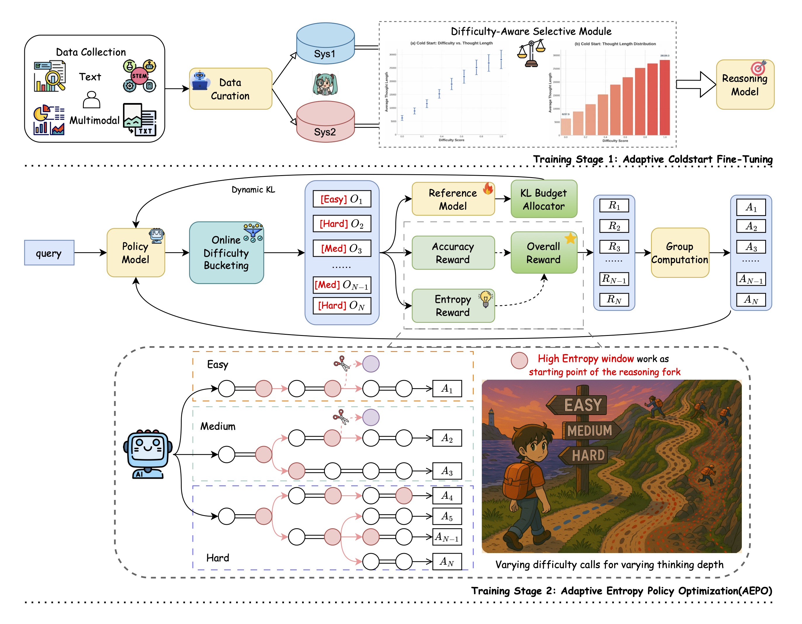
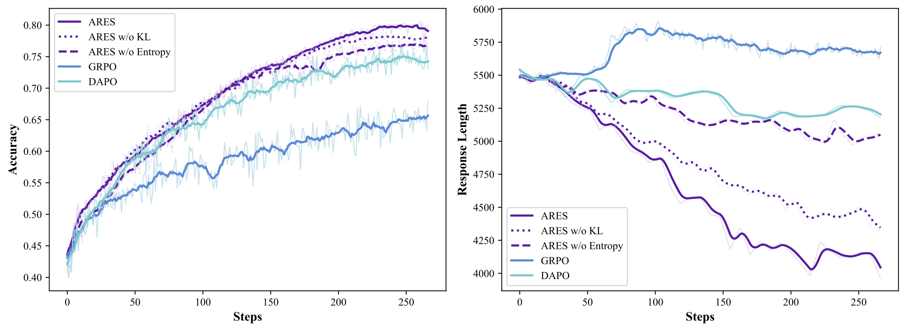

<div align="center">


  <h1 style="margin: 0; font-size: 1.8em;">
    
    ARES: Multimodal Adaptive Reasoning via Difficulty-Aware Token-Level Entropy Shaping
  </h1>

  [](https://arxiv.org/abs/2510.08457)
  [](https://www.alphaxiv.org/abs/2510.08457)
  [](https://github.com/shawn0728/ARES)
  [](https://huggingface.co/collections/ares0728/ares-68e7c7160dcb48734dee4e95)

  [](https://github.com/shawn0728/ARES)
  [](https://opensource.org/licenses/MIT)
   

</div>


## 📖 Introduction

This paper proposes **ARES**, a novel open-source framework for **adaptive multimodal reasoning**, aiming to dynamically allocate the model’s reasoning effort based on the **difficulty** of the input problem.
The authors observe a key imbalance in existing multimodal reasoning models: on **easy** tasks they tend to overthink (producing redundantly long inference traces), whereas on **hard** tasks they under-explore (missing solutions due to insufficient search). To correct this, ARES introduces a mechanism based on **High Window-Entropy (HWE)** tokens (i.e. token-level entropies averaged over a sliding window) to detect moments of reasoning uncertainty, and flexibly adapt the exploration intensity.

ARES is trained with a **two-stage pipeline**:

1. **Adaptive Cold-Start Stage**: construct multimodal and textual reasoning examples with trace lengths scaled to task difficulty, so the model learns a notion of difficulty awareness.

2. **Adaptive Entropy Policy Optimization (AEPO)**: use HWE tokens as triggers to decide *when* to explore further, combined with a **hierarchical entropy reward** and **dynamic KL control** to decide *how much* to explore.

Empirical results show that ARES achieves better tradeoffs between reasoning **efficiency** and **accuracy**, outperforming baselines across multimodal, mathematical, and logical benchmarks — while incurring lower inference costs, and narrowing the gap to commercial systems.ARES

This work highlights that adaptively modulating the exploration behavior at token-level (rather than a fixed strategy) is essential for balancing reasoning depth and computational cost under varying task difficulties.

## Results



Extensive experiments demonstrate that **ARES** achieves superior performance and reasoning efficiency across diverse mathematical, logical,and multimodal benchmarks, while closing the gap to leading commercial systems under significantly lower inference costs.



---

## Pipeline

Overall training pipeline of our method **ARES**. 
Stage 1 (Adaptive Coldstart Fine-Tuning):
difficulty-aware selective data curation and adaptive KL-guided fine-tuning establish a strong initialization across text and multimodal inputs. Stage 2 (Adaptive Entropy Policy Optimization, AEPO):
online difficulty bucketing and entropy-aware rollout allocate reasoning depth dynamically, with
high-entropy windows serving as branching points for exploration. Together, the two stages enable
uncertainty-aware, difficulty-adaptive reasoning for large language models.



---


## 🛠️ Installation
```bash
conda create -n aepo python=3.11 -y
conda activate aepo
pip install -r requirements.txt
```

---

## 🚀 Training

### Staged RL: AEPO
```bash
# example script to prepare rewards / launch AEPO
bash ./experiments/AEPO/train.sh
```

**Key ideas.**
- **HWE trigger:** branch only in sustained-uncertainty regions.
- **Difficulty-aware shaping:** suppress over-exploration on easy, encourage deeper exploration on hard, stabilize around a batch target on medium.
- **Dynamic KL:** token-wise KL budget that relaxes inside validated HWE windows.

---

## 🧩 Checkpoint Merge (HF format)
```bash
python scripts/model_merger.py \
  --local_dir ./checkpoints/${ProjectName}/exp_name/global_step_1/actor
```

## 🖥️ Inference

Run the command below.
```bash
MODEL_PATH="ARES"
MAX_TOKENS=16384
DO_SAMPLE=True
TEMPERATURE=1.0
TOP_P=0.95
TOP_K=50
NUM_RETURN_SEQUENCES=1


prompt = "You FIRST think about the reasoning process as an internal monologue and then provide the final answer. The reasoning process MUST BE enclosed within <think> </think> tags. The final answer MUST BE put in \\boxed{}."
question="xxx"


python infer.py \
 --model_path ${MODEL_PATH} \
 --image_path ${IMAGE_PATH} \
 --question ${question} \
 --prompt ${prompt} \
 --max_tokens ${MAX_TOKENS} \
 --do_sample ${DO_SAMPLE} \
 --temperature ${TEMPERATURE} \
 --top_p ${TOP_P} \
 --top_k ${TOP_K} \
 --num_return_sequences ${NUM_RETURN_SEQUENCES} 
```
You can also modify the arguments in `inference/inference.sh`
```shell
bash inference/inference.sh
```

---

## 📊 Highlights
- **ARES-3B:** +8.4 average over prior open 3B models across core multimodal benchmarks.
- **ARES-7B:** +9.7 average over strong 7B open baselines; large gains on MathVision and DynaMath-W.
- **Efficiency:** Shorter responses on easy/medium tasks; deeper but targeted exploration on hard tasks.




---

## 🙌 Acknowledgements
We thank the open-source community for tools, datasets, and prior work on reasoning-oriented pretraining and RL that inspired this project.


## 🚧 TODO

We are preparing to complete these tasks over the next few weeks, please stay tuned!

- 🚧 We are in the process of training for 3B Revisual-R1 and will release them in a few days.
- 🚧 We are also in the process of developing and open-sourcing a multimodal model with performance comparable to leading commercial systems. Stay tuned!

## 📮 Contact

For questions, feedback, or collaboration opportunities, feel free to reach out: csfufu0728@gmail.com


## 📄Citation

If you find our works useful for your research, please consider citing:
```
@misc{chen2025aresmultimodaladaptivereasoning,
      title={ARES: Multimodal Adaptive Reasoning via Difficulty-Aware Token-Level Entropy Shaping}, 
      author={Shuang Chen and Yue Guo and Yimeng Ye and Shijue Huang and Wenbo Hu and Haoxi Li and Manyuan Zhang and Jiayu Chen and Song Guo and Nanyun Peng},
      year={2025},
      eprint={2510.08457},
      archivePrefix={arXiv},
      primaryClass={cs.CL},
      url={https://arxiv.org/abs/2510.08457}, 
}
```

